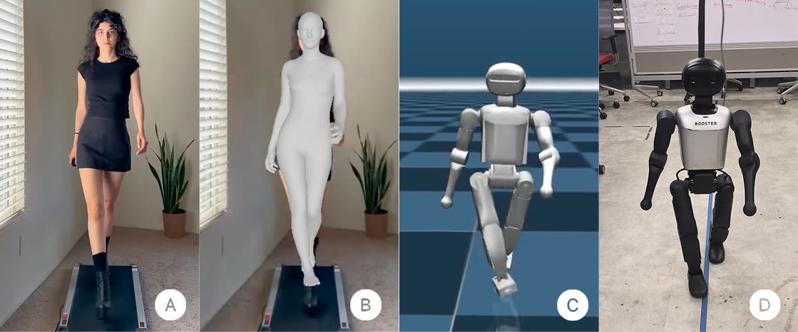

<div align="center">

# Expressive Motion

**Learning Expressive Humanoid Locomotion from Monocular Runway Videos**

Kyrylo Kolesnichenko<sup>1,2</sup> · Irvin Steve Cardenas<sup>1</sup> · Jong-Hoon Kim<sup>1</sup>

<sup>1</sup> Advanced Telerobotics Research Laboratory, Kent State University · <sup>2</sup> Vilnius University

[**Project page**](https://kyk0.github.io/expressive-motion/) ·
[**Paper**](paper/Expressive_Humanoid_Locomotion.pdf) ·
[**Poster**](docs/video/expressive-motion_poster.pdf) ·
[**Video**](https://kyk0.github.io/expressive-motion/video/)


[](LICENSE)



<sub>(A) monocular runway video → (B) recovered 3D human motion → (C) retargeted motion in simulation → (D) physical Booster K1</sub>

</div>

Expressive Motion turns a single monocular video of a person walking into a Booster K1 reference motion and a ready-to-train BeyondMimic task. It connects pinned GVHMR, GMR and Booster checkouts into one script; training and deployment stay manual upstream operations.

On the physical K1, the learned catwalk policy completed **20 of 20 trials without a fall** (≈23 steps each) and walked with a step width of **−0.8 to 1.8 cm**, against 5.1 to 11.4 cm for the stock K1 gait, including occasional crossover steps.

## Overview

Give the pipeline a video of a person moving and it returns a grounded motion clip a Booster K1 can be trained to imitate.

```
video → 30 fps → GVHMR → ground alignment → GMR retarget → CSV → Booster NPZ → task
        ffmpeg   (GPU)    (this repo)        (CPU)                 (Isaac Lab)
```

- **GVHMR** lifts the video into SMPL-X body parameters in world space.
- **This repository** detects foot contacts, levels the floor and removes root drift.
- **GMR** solves an optimisation mapping the human skeleton onto the robot's joints.
- **Booster Train** receives a generated BeyondMimic task.

GVHMR runs in static-camera mode, so DPVO is skipped. The complete path supports `booster_k1`.

Two conda environments are created because GVHMR and GMR have incompatible dependency pins. The split is load-bearing, not stylistic.

## Prerequisites

- **OS**: x86_64 Linux. The pinned `pytorch3d` wheel is `linux_x86_64` only.
- **Conda**: 4.9 or newer.
- **GPU**: NVIDIA GPU with a driver exposing CUDA 12.1+, for GVHMR only.
- **Disk**: about 25 GB for the environments, plus 5.2 GB of weights.

```bash
sudo apt update && sudo apt install -y ffmpeg git
```

Isaac Lab, the SMPL/SMPL-X body models, the GVHMR checkpoints and the Booster SDK are licensed by third parties and are not installed automatically.

## Quick Start

```bash
git clone --recursive https://github.com/Kyk0/expressive-motion.git
cd expressive-motion
bash install.sh                  # creates the conda environments
# add the licensed body models and checkpoints, see below

conda activate expressive-motion
python scripts/process.py inputs/videos/ai1.mp4 --isaac-env YOUR_ISAAC_ENV
python scripts/make_task.py --clip ai1
```

## Installation

`bash install.sh` initialises the submodules and creates two conda environments:

| Environment | What it is for |
| --- | --- |
| `expressive-motion` | The one you activate. Retargeting, CSV conversion, task generation |
| `expressive-motion-gvhmr` | GVHMR inference, needs a CUDA GPU. Called for you by `process.py`; you never activate it |

They are separate because GVHMR and GMR pin incompatible dependencies.

```bash
bash install.sh                        # both environments
bash install.sh main                   # expressive-motion only (no GPU needed)
bash install.sh gvhmr                  # expressive-motion-gvhmr only
bash install.sh isaac env_isaaclab     # add Booster packages to your Isaac Lab env
```

Re-running is safe: existing environments are reused and packages reinstalled. Isaac Lab itself is never installed; the `isaac` target only adds `booster_assets` and `booster_train` to an environment you already have.

## Body Models and Weights

This is the step that usually blocks a fresh install. About **5.2 GB** total. Nothing here can be downloaded automatically.

### 1. Register for the body models

Separate registrations, each requiring a signed licence:

- **SMPL-X**: https://smpl-x.is.tue.mpg.de/ → `SMPLX_NEUTRAL.npz` (104 MB)
- **SMPL**: https://smpl.is.tue.mpg.de/ → `SMPL_NEUTRAL.pkl` (236 MB). Some archives name it `basicmodel_neutral_lbs_10_207_0_v1.1.0.pkl`; rename it.

### 2. Download the GVHMR checkpoints

From the upstream Google Drive folder — downloading means accepting the upstream licences:

https://drive.google.com/drive/folders/1eebJ13FUEXrKBawHpJroW0sNSxLjh9xD

| File | Size | Needed for |
| --- | --- | --- |
| `gvhmr/gvhmr_siga24_release.ckpt` | 156 MB | GVHMR |
| `hmr2/epoch=10-step=25000.ckpt` | 2.6 GB | HMR2.0a features |
| `vitpose/vitpose-h-multi-coco.pth` | 2.4 GB | 2D pose |
| `yolo/yolov8x.pt` | 131 MB | Person detection |
| `dpvo/dpvo.pth` | 14 MB | Optional, moving-camera only |

`dpvo.pth` is not needed: this repository passes `-s` to GVHMR, which skips DPVO.

### 3. Place the files

```bash
mkdir -p external/GVHMR/inputs/checkpoints/{body_models/smpl,body_models/smplx,gvhmr,hmr2,vitpose,yolo}
```

The result must match:

```text
external/GVHMR/inputs/checkpoints/
├── body_models/smpl/SMPL_NEUTRAL.pkl
├── body_models/smplx/SMPLX_NEUTRAL.npz
├── gvhmr/gvhmr_siga24_release.ckpt
├── hmr2/epoch=10-step=25000.ckpt
├── vitpose/vitpose-h-multi-coco.pth
└── yolo/yolov8x.pt
```

GMR needs the same SMPL-X model at a second path. Symlink rather than copy:

```bash
mkdir -p external/GMR/assets/body_models/smplx
ln -s "$(pwd)/external/GVHMR/inputs/checkpoints/body_models/smplx/SMPLX_NEUTRAL.npz" \
      external/GMR/assets/body_models/smplx/SMPLX_NEUTRAL.npz
```

### 4. Verify

```bash
python scripts/process.py inputs/videos --dry-run
```

lists any weight that is still missing. A full run refuses to start until they are all present.

**⚠️ Never commit these files.** They are non-commercial licensed. Three separate `.gitignore` files cover them, and because `external/GMR` and `external/GVHMR` are submodules the parent repository structurally cannot contain them. The real risk is `git add` *inside* a submodule.

## Usage

Activate the environment once per terminal, then run the scripts directly. Every script has `--help`.

```bash
conda activate expressive-motion

python scripts/process.py inputs/videos/ai1.mp4 --dry-run   # probe only, runs nothing
python scripts/process.py inputs/videos/ai1.mp4             # full pipeline
python scripts/process.py inputs/videos --recursive         # a whole tree
python scripts/process.py inputs/videos/ai1.mp4 --force     # recompute existing stages

python scripts/make_task.py --clip ai1                      # generate and register a task
python scripts/retarget_gvhmr.py --list-robots              # robots GMR can retarget onto
```

The last stage of `process.py` converts the motion inside Isaac Lab. Name that environment with `--isaac-env`, or once per shell with `export EM_ISAAC_ENV=env_isaaclab`.

`ai1.mp4` produces motion name `ai1`. Completed stages are reused unless `--force` is given, logs land in `outputs/<clip>/logs/`, and one failing clip does not abort a batch.

Outputs:

```text
outputs/ai1/gvhmr/ai1/hmr4d_results.pt                     # SMPL-X world params
outputs/ai1/robot_data/booster_k1/ai1_booster_k1.pkl       # retargeted trajectory
outputs/ai1/robot_data/booster_k1/csv/ai1_booster_k1.csv   # joint CSV
external/booster/booster_assets/motions/K1/ai1.{csv,npz}   # installed motion
```

`make_task.py` renders the template into Booster Train, registers it, and **prints but does not run** the training command. The default task id is `Booster-K1-Ai1-v0`.

### Training and deployment

Manual upstream operations:

```bash
cd external/booster/booster_train
python scripts/rsl_rl/train.py --task=Booster-K1-Ai1-v0 --headless --device cuda:0
python scripts/rsl_rl/play.py --task=Booster-K1-Ai1-v0 --checkpoint=/path/to/checkpoint.pt

cd ../booster_deploy
python scripts/deploy.py --list
python scripts/deploy.py --task TASK_NAME --mujoco
```

**⚠️ Hardware execution additionally requires the upstream SDK, firmware, ROS 2, networking and safety procedures. This repository never starts it automatically.**

## Configuration

Configuration lives in `configs/` and resolves relative to the repository, not the working directory. Any leaf can be overridden per run with `--set key=value`.

| File | Contents |
| --- | --- |
| `configs/pipeline.json` | Contact detection, ground alignment, retargeting, training defaults |
| `configs/paths.json` | Booster checkouts, pinned commits, upstream subpaths |
| `configs/robots/booster_k1.json` | Robot control rate and joints |

```bash
python scripts/process.py inputs/videos/ai1.mp4 --set ground.enabled=false
python scripts/make_task.py --clip ai1 --set train.max_iterations=15000
```

## Troubleshooting

**`GMR is not importable here. Run: conda activate expressive-motion`**

The environment is not active in this terminal, or was never created (`bash install.sh main`).

**`ModuleNotFoundError: No module named 'pkg_resources'`**

```bash
# lightning==2.3.0 needs pkg_resources, which setuptools >= 81 removed
conda run -n expressive-motion-gvhmr python -m pip install 'setuptools<81'
```

The installer pins this correctly; a later `pip install --upgrade setuptools` reintroduces it.

**`The last stage (CSV to NPZ) runs in Isaac Lab`**

Pass `--isaac-env your_isaac_conda_env`, or `export EM_ISAAC_ENV=your_isaac_conda_env`.

**GVHMR fails with a CUDA or missing-file error**

```bash
conda run -n expressive-motion-gvhmr python -c "import torch; print(torch.version.cuda, torch.cuda.is_available())"
# expect: 12.1 True
python scripts/process.py inputs/videos --dry-run   # lists any absent checkpoint
```

**Pinned Booster commit mismatch**

```bash
git submodule update --init --recursive
```

⚠️ A forced submodule update discards generated tasks and motions written into `booster_train` and `booster_assets`.

## Known Limitations

1. **Static camera only.** Moving-camera clips need the DPVO path, which is not wired up.
2. **One robot.** The complete path supports `booster_k1`; GMR itself supports more (`--list-robots`).
3. **Booster checkouts are modified in place.** Generated tasks live inside the submodules, so they always show as dirty in `git status`.
4. **The GVHMR environment is frozen.** Python 3.10, torch 2.3.0, cu121 and numpy 1.23.5 are mutually load-bearing, and the pinned `pytorch3d` wheel installs without complaint when they no longer match.
5. **`--dry-run` skips the Booster and Isaac preflight checks**, so it can pass where a full run would not.

## Repository Structure

```text
expressive-motion/
├── install.sh                  # creates the conda environments
├── configs/                    # paths, pipeline and robot configuration
├── scripts/
│   ├── process.py              # video to installed Booster motion
│   ├── make_task.py            # task generation
│   ├── retarget_gvhmr.py       # single-clip retargeting
│   └── expressive_motion/      # internal helpers
├── overlay/train/task_template # rendered into booster_train
├── paper/                      # LaTeX source, figure and PDF
├── docs/                       # GitHub Pages project page
├── external/                   # pinned upstream submodules
│   ├── GVHMR/                  # monocular motion recovery
│   ├── GMR/                    # motion retargeting
│   └── booster/                # booster_train, booster_assets, booster_deploy
├── inputs/videos/              # your source videos (git-ignored)
├── outputs/                    # per-clip stage outputs (git-ignored)
└── README.md                   # This file
```

Do not commit inputs, outputs, checkpoints, licensed models, trained policies or robot credentials.

## Project page

`docs/` is served by GitHub Pages from branch `main`, folder `/docs`:

| URL | Source | Purpose |
| --- | --- | --- |
| https://kyk0.github.io/expressive-motion/ | `docs/index.html` | Project page |
| https://kyk0.github.io/expressive-motion/video/ | `docs/video/index.html` | Poster QR target, video-first for phones |

The poster QR code encodes the `/video/` URL, so it must keep resolving. To change the clip without reprinting, replace `docs/video/demo.mp4` (H.264 MP4, keep it under ~20 MB) and regenerate the still frame:

```bash
ffmpeg -y -ss 1 -i docs/video/demo.mp4 -frames:v 1 -q:v 4 docs/video/poster.jpg
```

## License

The code in this repository is MIT licensed — see [LICENSE](LICENSE).

**⚠️ The pipeline as a whole is research and non-profit use only.** The MIT grant covers this repository's own code and nothing else. Two dependencies independently forbid commercial use:

- **GVHMR** (ZJU 3D Vision Group) — *"educational, research and non-profit purposes only. Any modification based on this work must be open-source and prohibited for commercial use."* Commercial enquiries: xwzhou@zju.edu.cn
- **SMPL / SMPL-X** (Max Planck Institute) — non-commercial research licence, registration required, redistribution prohibited.

| Component | License | Commercial |
| --- | --- | --- |
| This repository | MIT | Yes |
| `external/GVHMR` | Research / non-profit only | **No** |
| `external/GMR` | MIT | Yes |
| `booster_train`, `booster_deploy` | Apache-2.0 | Yes |
| `booster_assets` | BSD-3-Clause | Yes |
| SMPL / SMPL-X | MPI non-commercial | **No** |

GMR ships robot assets under mixed licences; `fourier_n1` is LGPL-3.0 and `external/GMR/third_party/poselib` carries no licence file. Neither affects the `booster_k1` path.

## Citation

```bibtex
@misc{kolesnichenko2026expressive,
  title  = {Learning Expressive Humanoid Locomotion from Monocular Runway Videos},
  author = {Kolesnichenko, Kyrylo and Cardenas, Irvin Steve and Kim, Jong-Hoon},
  year   = {2026},
  url    = {https://github.com/Kyk0/expressive-motion}
}
```

Please also cite [GVHMR](https://github.com/zju3dv/GVHMR), [GMR](https://github.com/YanjieZe/GMR) and [BeyondMimic](https://beyondmimic.github.io/) as their authors request.

## Acknowledgements

Built on [GVHMR](https://github.com/zju3dv/GVHMR), [GMR](https://github.com/YanjieZe/GMR), [BeyondMimic](https://beyondmimic.github.io/) and the [Booster Robotics](https://github.com/BoosterRobotics) training, deployment and asset repositories.
